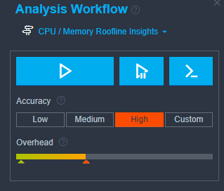
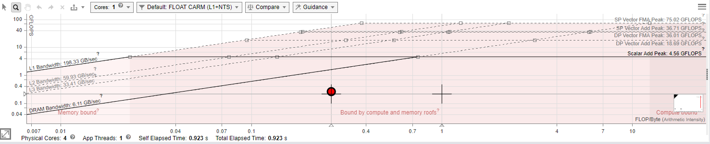
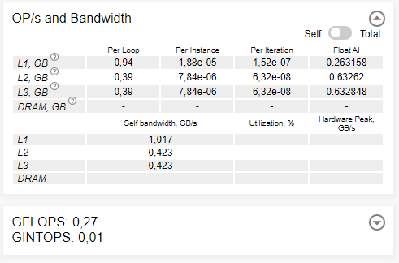

# Modelo de teto
## Computação de Alto Desempenho

*Lucas Ribeiro Ikuhara - DRE 119019172*

---

### Introdução

O objetivo deste trabalho é a realização de um modelo de teto para avaliarmos a
performance teórica máxima de um sistema e avaliar a performance de um programa em relação a esses valores teóricos.

### Código fonte

O código fonte utilizado foi o laplace.cxx provido na tarefa, com uma única alteração: a retirada da leitura de inputs.

```c++
std::cout << "Enter nx n_iter eps --> ";

//std::cin >> nx >> n_iter >> eps;
nx = 500;
n_iter = 100;
eps = 1e-6;
```

Os valores utilizados foram os mesmos do último trabalho sobre perfiladores.

### Descobrindo a Performance de Pico e Intensidade Aritmética

Para a descoberta da performance de pico e a intensidade aritmética foi usado o programa Intel Advisor. Foi criado um projeto a partir do executável compilado com a opção "Collect information about FLOP, L1 memory traffic, and AVX-512 mask usage" do menu "Trip Counts and FLOP Analysis" habilitado.

Para o tipo de análise, foi usada a configuração de preset de CPU / Memory e Roofline insights.


A análise foi conduzida com a configuração de acurácia máxima possível:



Gerando o seguinte resultado de modelo de teto:



No modelo gerado podemos ver diversas "linhas de teto" diferentes, pois como a linha depende da performance da memória, é gerado um teto diferente para a memória RAM e para os diferentes níveis de cache L1, L2 e L3. O ponto vermelho indica a posição do programa testado no gráfico.

O próprio programa avalia que o código é limitado por ambos memória e processamento. Essa análise, é no entretanto enganosa sem uma interpretação mais a fundo.

O programa seria limitado por processamento se considerarmos a banda da memória L1. Na realidade, se considerarmos qualquer outro nível de memória, o gargalo da execução seria dado por memória.

A intensidade aritmética medida foi de 0.27 GFLOPS segunda os dados coletados pelo programa:


